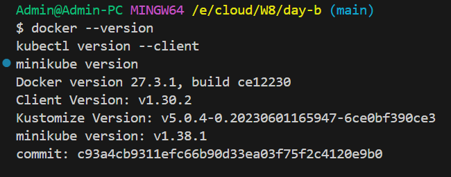
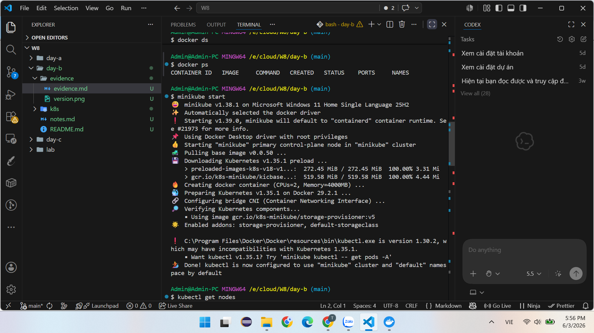
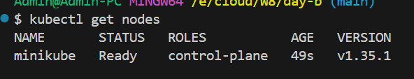
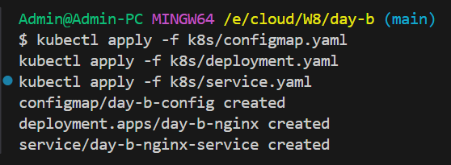
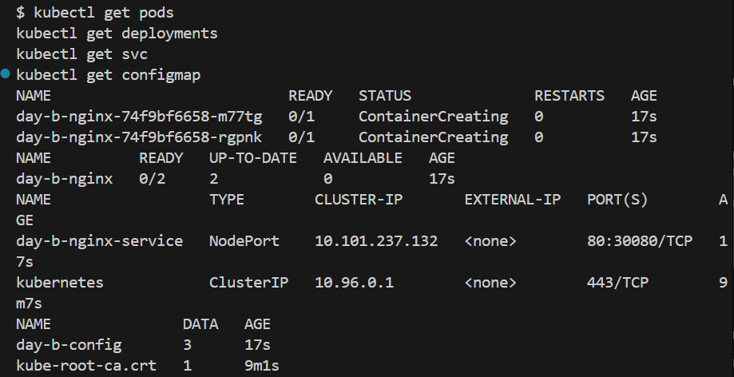
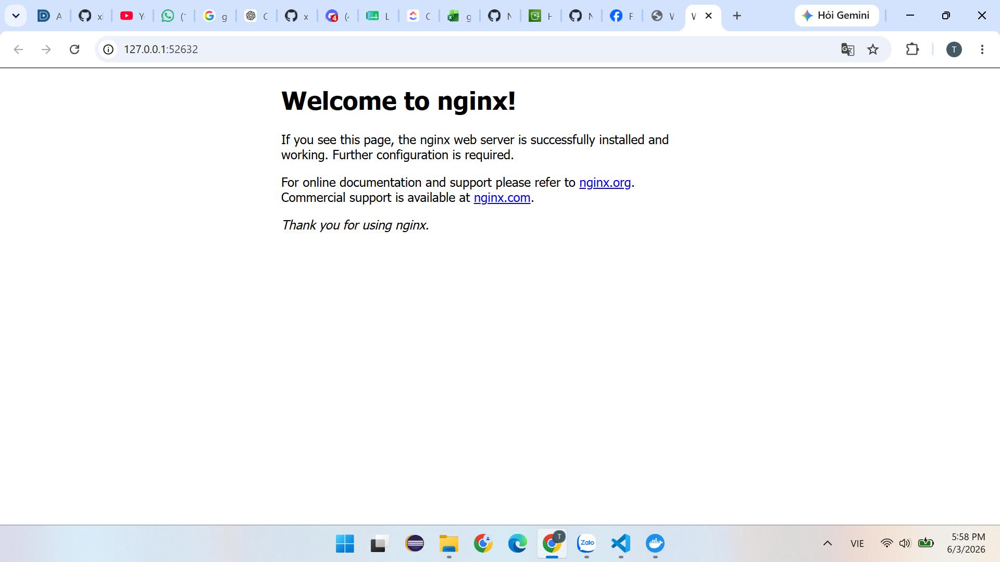

# Evidence - W8 Day B

## Tool versions
- Docker installed successfully
- kubectl installed successfully
- minikube installed successfully

## Minikube cluster
- minikube started successfully using Docker driver
- Kubernetes node status is Ready

## Kubernetes resources
- ConfigMap created
- Deployment created
- 2 nginx Pods running
- Service created with NodePort

## Application access
- Nginx application was exposed through minikube service
- Browser displayed the Nginx welcome page

