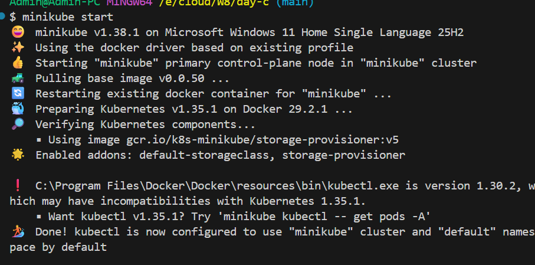
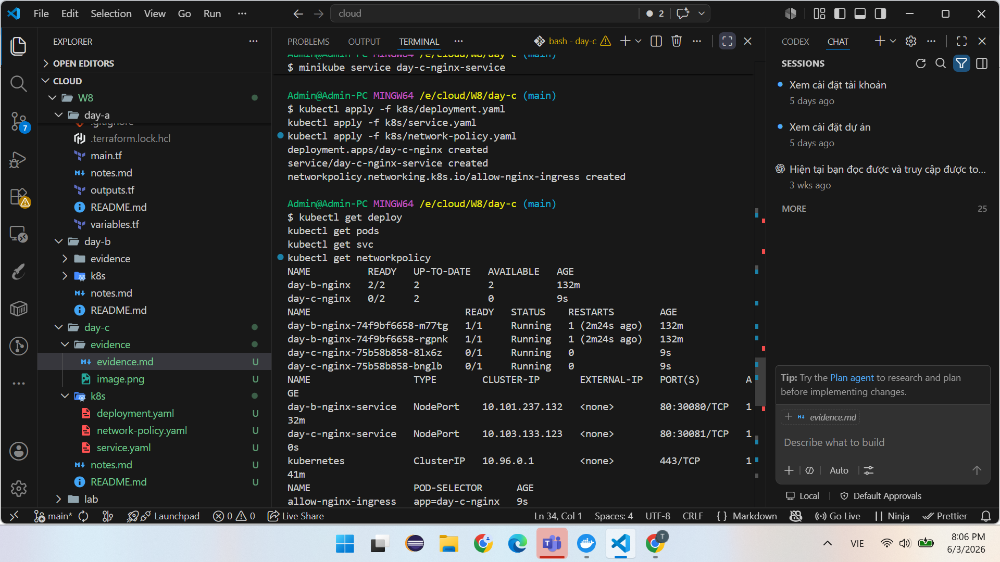
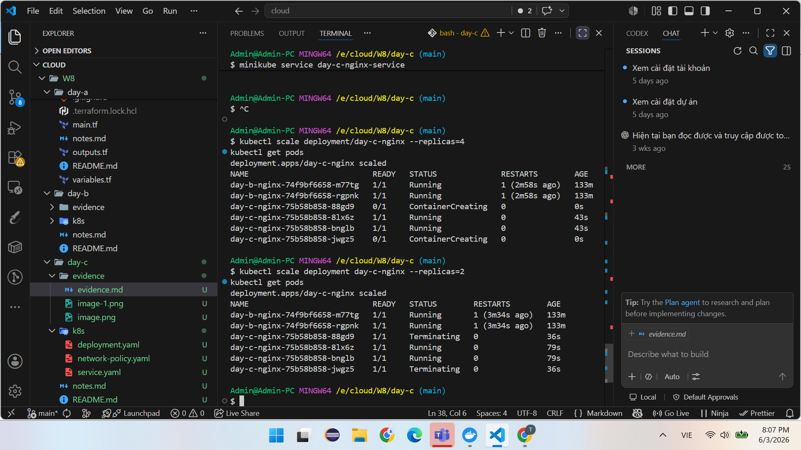
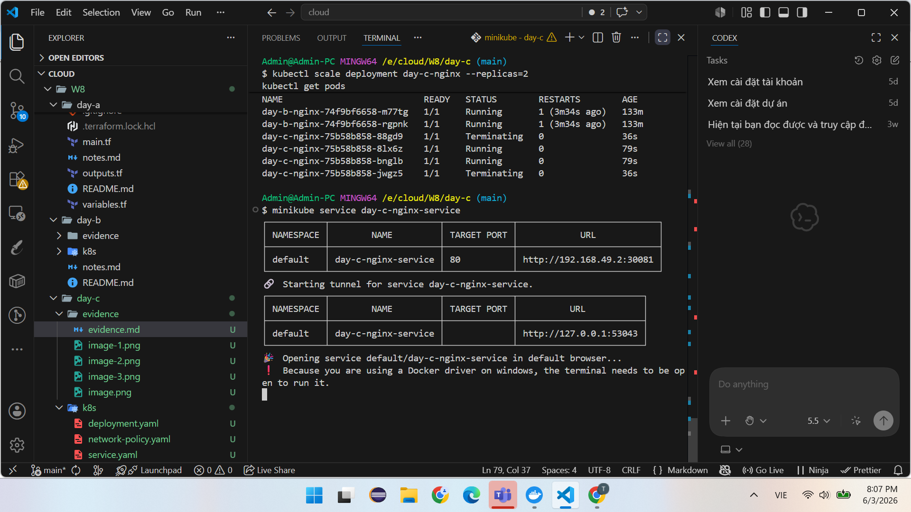
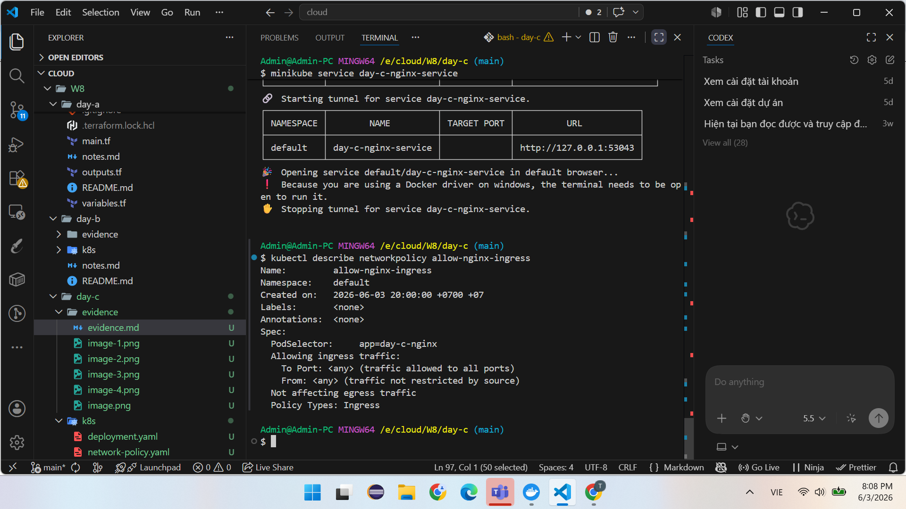

# Evidence - W8 Day C

## Môi trường thực hiện

* Docker Desktop đã cài đặt
* kubectl đã cài đặt
* Minikube đã cài đặt
* Driver sử dụng: Docker

---

## Evidence 1 - Khởi động Cluster

Lệnh:

```bash
minikube start
kubectl get nodes
```

Ảnh minh chứng:



Kết quả:

* Minikube khởi động thành công.
* Node ở trạng thái Ready.

---

## Evidence 2 - Deployment



## Evidence 6 - Scale Up

Lệnh:

```bash
kubectl scale deployment/day-c-nginx --replicas=4
kubectl get pods
```

Ảnh minh chứng:


Kết quả:

* Hệ thống tăng từ 2 Pod lên 4 Pod.

---

## Evidence 7 - Scale Down

Lệnh:

```bash
kubectl scale deployment/day-c-nginx --replicas=2
kubectl get pods
```

Ảnh minh chứng:



Kết quả:

* Hệ thống giảm từ 4 Pod xuống 2 Pod.

---

## Evidence 8 - Truy cập ứng dụng

Lệnh:

```bash
minikube service day-c-nginx-service
```

Ảnh minh chứng:



Kết quả:

* Truy cập thành công trang nginx.

---

## Evidence 9 - Chi tiết Network Policy

Lệnh:

```bash
kubectl describe networkpolicy allow-nginx-ingress
```

Ảnh minh chứng:



Kết quả:

* Chính sách mạng được cấu hình đúng theo yêu cầu.
