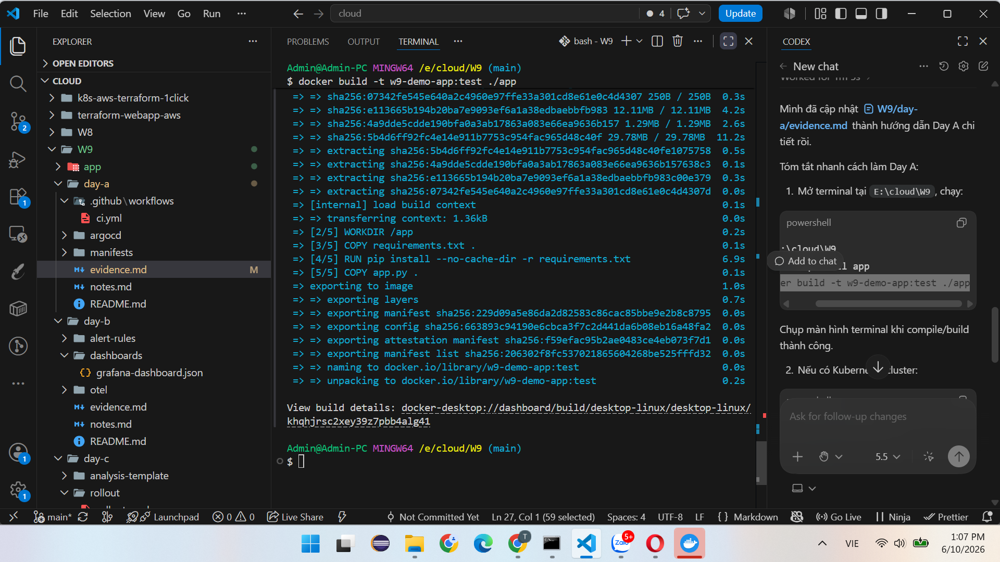
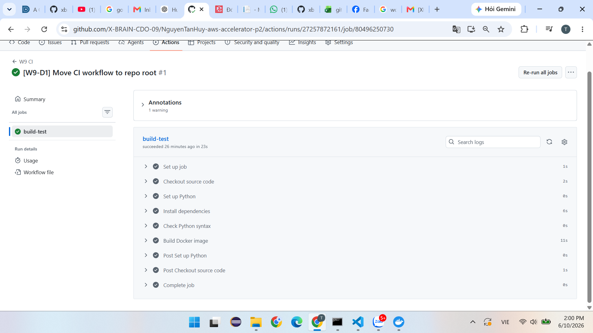
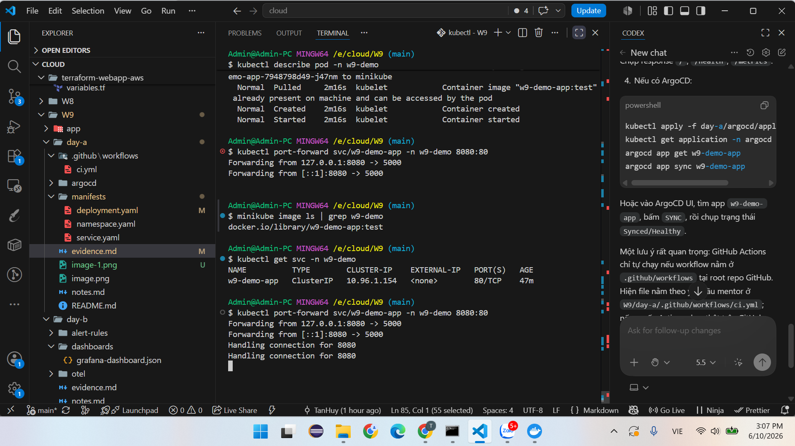
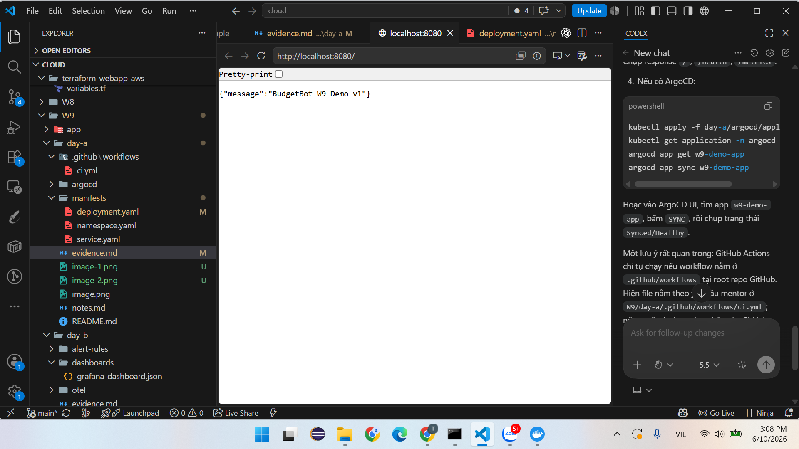

# Day A Evidence Checklist

Muc tieu cua evidence Day A la chung minh repo da co CI/CD, Docker build, Kubernetes manifest va GitOps bang ArgoCD. Neu chua co cluster that, van co the chup bang chung local va GitHub. Neu co cluster/ArgoCD, chup them phan sync.

## 1. Chuan bi truoc khi demo

Can thay placeholder truoc khi day len GitHub:

- `YOUR_GITHUB_USERNAME`: doi thanh username GitHub cua ban.
- `YOUR_REPO`: doi thanh ten repo cua ban.
- `ghcr.io/YOUR_GITHUB_USERNAME/w9-demo-app:v1`: doi thanh image name that neu ban co push image.

File can mo cho mentor xem:

- [ ] `app/app.py`
- [ ] `app/Dockerfile`
- [ ] `day-a/.github/workflows/ci.yml`
- [ ] `day-a/manifests/deployment.yaml`
- [ ] `day-a/argocd/application.yaml`

## 2. Lenh local can chay trong terminal

Tu thu muc `E:\cloud\W9`, chay:

```powershell
cd E:\cloud\W9
py -m compileall app
docker build -t w9-demo-app:test ./app
```

Can chup:

- [ ] Terminal hien `Compiling 'app\\app.py'...` hoac khong co loi compile.
- [ ] Terminal hien Docker build thanh cong, co dong `naming to docker.io/library/w9-demo-app:test` hoac `Successfully tagged w9-demo-app:test`.

Neu may chua mo Docker Desktop, mo Docker Desktop truoc roi chay lai lenh build.


## 3. GitHub Actions evidence

Luu y quan trong: GitHub Actions chi tu dong chay khi workflow nam trong `.github/workflows` o root cua repo GitHub. Neu ban push rieng thu muc `W9` lam repo rieng, file `day-a/.github/workflows/ci.yml` la theo yeu cau mentor nhung co the khong tu chay tren GitHub. Neu mentor muon Actions chay that, copy workflow len root repo thanh `.github/workflows/w9-ci.yml` hoac dat `W9` lam repo rieng va dua workflow ve `.github/workflows/ci.yml`.

Thao tac tren GitHub:

1. Push code len GitHub.
2. Mo tab `Actions`.
3. Chon workflow `W9 CI`.
4. Mo run moi nhat.
5. Mo job `build-test`.

Can chup:

- [ ] Man hinh tab `Actions` co workflow `W9 CI`.
- [ ] Run co dau tick xanh.
- [ ] Cac step: `Checkout`, `Set up Python`, `Install requirements`, `Compile Python files`, `Build Docker image`.

## 4. Kubernetes evidence neu co cluster

Tu thu muc `E:\cloud\W9`, chay:

```powershell
kubectl apply -f day-a/manifests/
kubectl get ns w9-demo
kubectl get deploy -n w9-demo
kubectl get pods -n w9-demo -o wide
kubectl get svc -n w9-demo
kubectl describe deploy w9-demo-app -n w9-demo
```

Can chup:

- [ ] `kubectl get ns w9-demo` thay namespace ton tai.
- [ ] `kubectl get deploy -n w9-demo` thay deployment `w9-demo-app`.
- [ ] `kubectl get pods -n w9-demo -o wide` thay 2 pods `Running` hoac dang pull image.
- [ ] `kubectl get svc -n w9-demo` thay service `w9-demo-app` port `80`.
- [ ] `kubectl describe deploy` thay readinessProbe/livenessProbe goi `/health`.

Neu image placeholder chua thay bang image that, pod co the bi `ImagePullBackOff`. Khi do chup YAML va noi voi mentor: manifest da dung placeholder de thay image sau.

## 5. Test app neu pod da Running

Chay:

```powershell
kubectl port-forward svc/w9-demo-app -n w9-demo 8080:80
```

Mo terminal khac va chay:

```powershell
curl http://localhost:8080/
curl http://localhost:8080/health
curl http://localhost:8080/metrics
```

Can chup:

- [ ] `/` tra ve `BudgetBot W9 Demo v1`.
- [ ] `/health` tra ve `{"status":"healthy"}`.
- [ ] `/metrics` co `http_requests_total` va `http_request_duration_seconds`.

## 6. ArgoCD evidence neu co ArgoCD

Apply ArgoCD Application:

```powershell
kubectl apply -f day-a/argocd/application.yaml
kubectl get application -n argocd
```

Neu co ArgoCD CLI:

```powershell
argocd app get w9-demo-app
argocd app sync w9-demo-app
argocd app get w9-demo-app
```

Thao tac tren ArgoCD UI:

1. Mo ArgoCD UI.
2. Tim app `w9-demo-app`.
3. Bam app de xem resource tree.
4. Neu chua sync, bam `SYNC`.
5. Chon `Synchronize`.

Can chup:

- [ ] App `w9-demo-app` hien trong ArgoCD.
- [ ] Trang thai `Synced`.
- [ ] Trang thai `Healthy` neu image chay duoc.
- [ ] Resource tree co Namespace, Deployment, Service.
- [ ] History hoac event sync moi nhat.

## 7. Neu chua co cluster/ArgoCD

Van co the nop evidence Day A bang:

- [ ] Screenshot tree thu muc Day A.
- [ ] Screenshot `py -m compileall app` thanh cong.
- [ ] Screenshot `docker build -t w9-demo-app:test ./app` thanh cong.
- [ ] Screenshot GitHub repo co workflow, manifest va ArgoCD YAML.
- [ ] Screenshot GitHub Actions neu da dua workflow ve dung root `.github/workflows`.

## Tom tat cau noi voi mentor

"Day A cua em da co Flask app, Dockerfile, CI workflow, Kubernetes manifest va ArgoCD Application. Local em da compile app va build Docker image thanh cong. Neu co cluster, em apply manifest vao namespace `w9-demo`, verify pods/service, port-forward test `/health`, sau do sync bang ArgoCD de chung minh GitOps."
