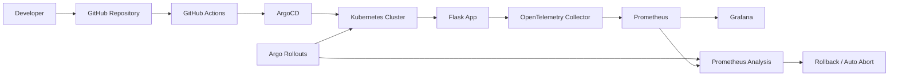

# W9 Architecture

## So do tong quan

## Giai thich ngan

Developer push code len GitHub. GitHub Actions kiem tra va build image mau. ArgoCD doc manifest trong Git va sync vao Kubernetes. App expose health va metrics. OpenTelemetry Collector va Prometheus thu thap tin hieu. Grafana hien thi dashboard. Argo Rollouts dung Prometheus Analysis de quyet dinh tiep tuc, dung lai hoac rollback canary.
