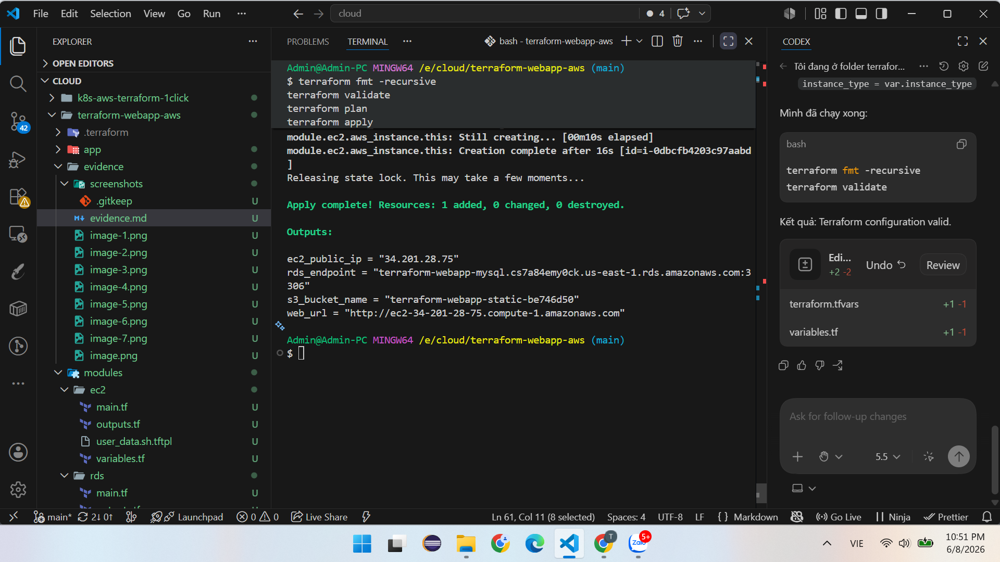
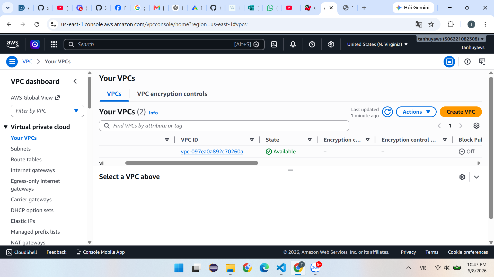
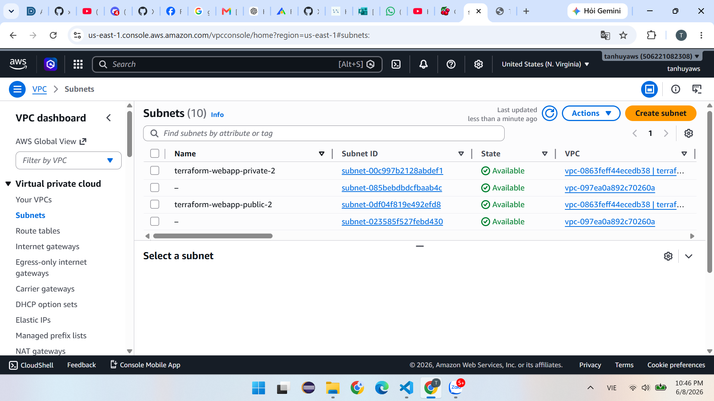
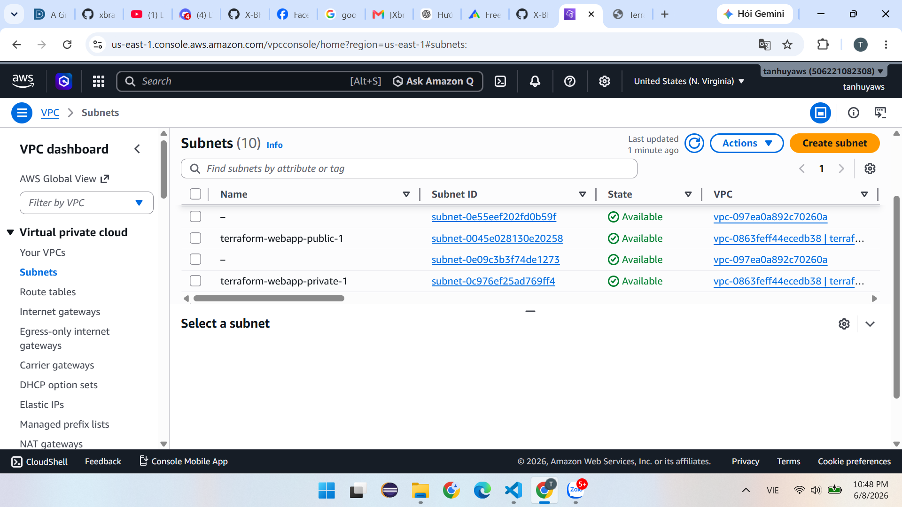
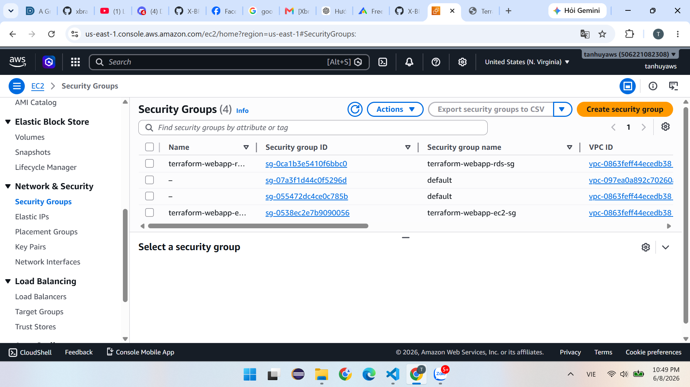
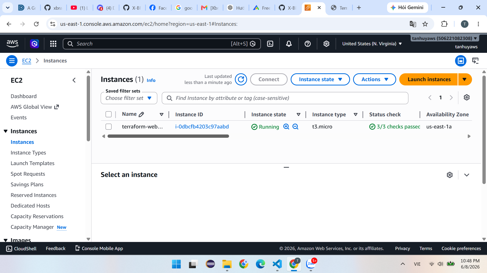
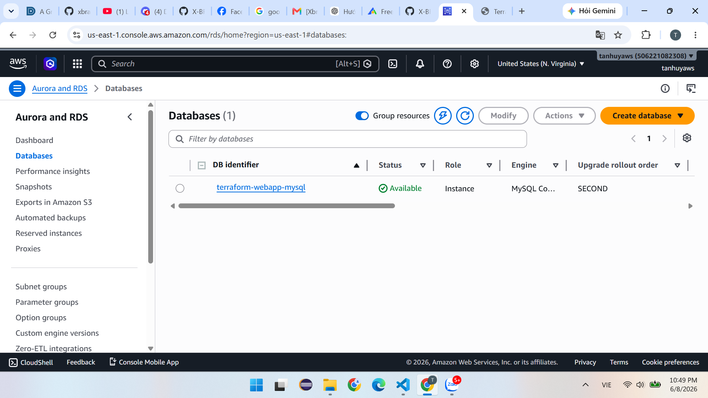
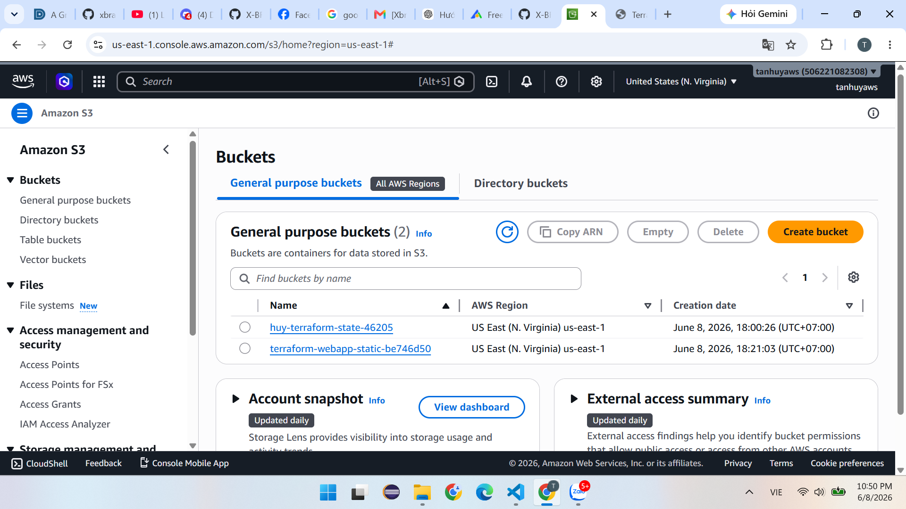
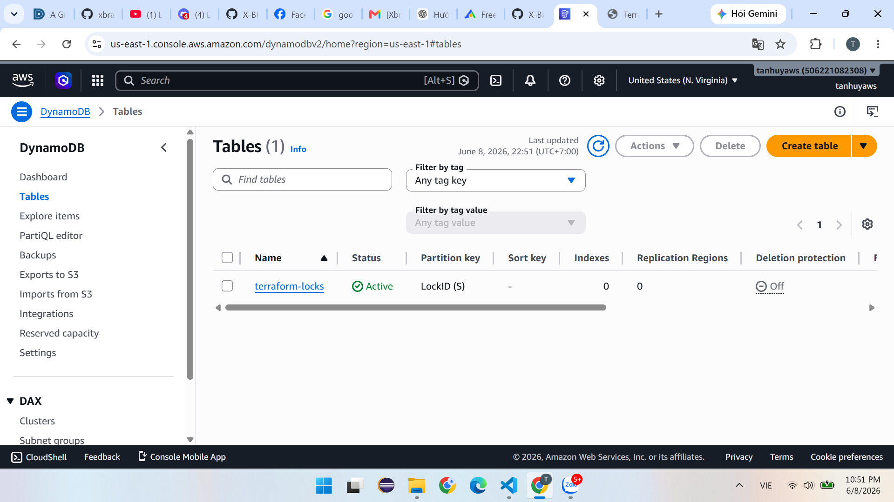
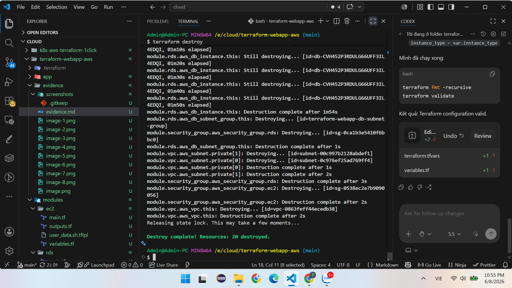

# Evidence - Terraform Web App AWS

Dung file nay de dan anh chup man hinh va ghi chu khi bao cao mentor.

## 1. Terraform init / validate / plan

- Anh chup terminal chay `terraform init`
- Anh chup terminal chay `terraform validate`
- Anh chup terminal chay `terraform plan`

## 2. Terraform apply thanh cong

- Anh chup terminal hien output: `ec2_public_ip`, `web_url`, `rds_endpoint`, `s3_bucket_name`

## 3. VPC va subnet

- Anh chup AWS Console: VPC custom
- 2 public subnets
- 2 private subnets
- Internet Gateway
- Public Route Table co route `0.0.0.0/0` tro den IGW

## 4. Security Groups

- EC2 SG mo HTTP 80 tu Internet
- EC2 SG mo SSH 22 theo `ssh_cidr`
- RDS SG chi mo MySQL 3306 tu EC2 SG

## 5. EC2 web server

- Anh chup EC2 instance running
- Anh chup trinh duyet mo `web_url`

## 6. RDS MySQL private

- Anh chup RDS instance available
- Anh chup RDS khong public accessible

## 7. S3 static assets bucket

- Anh chup S3 bucket duoc tao voi suffix unique

## 8. Destroy

- Anh chup terminal chay `terraform destroy` thanh cong de chung minh da don resource tranh ton phi

